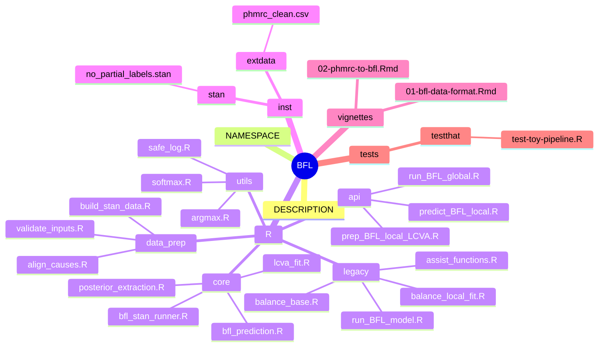

# BFL (Bayesian Federated Learning for Verbal Autopsy)

This repository contains a **prototype implementation (v0.01)** of Bayesian
Federated Learning (BFL) for verbal autopsy data.

The package is structured to clearly separate:
- user-facing APIs,
- core BFL mechanics,
- data alignment / validation,
- and legacy reference code.

---

## Package structure

