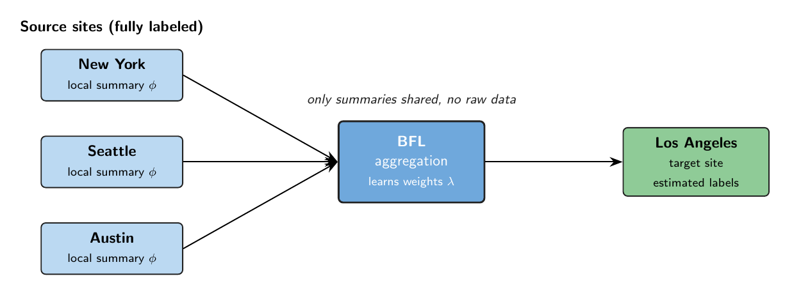
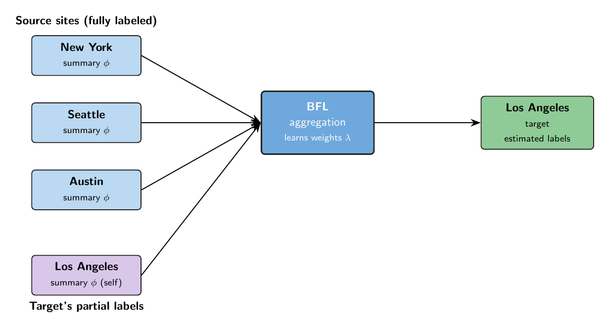
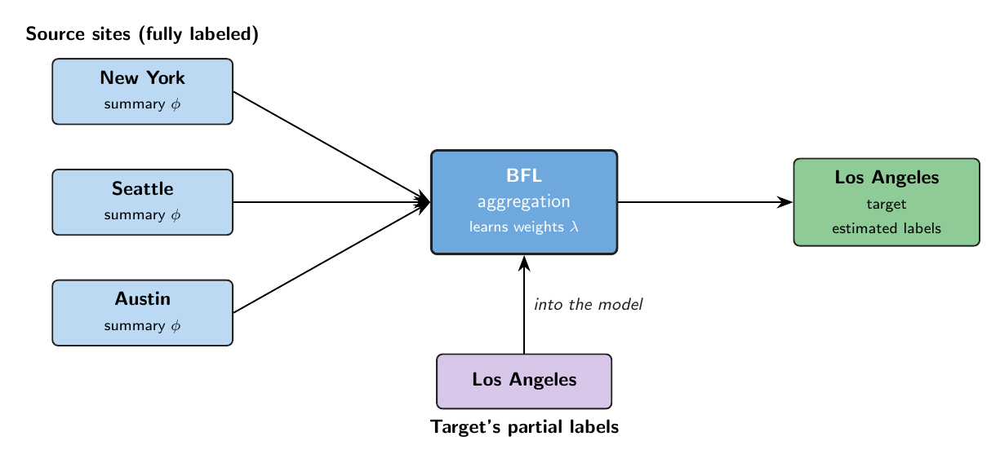
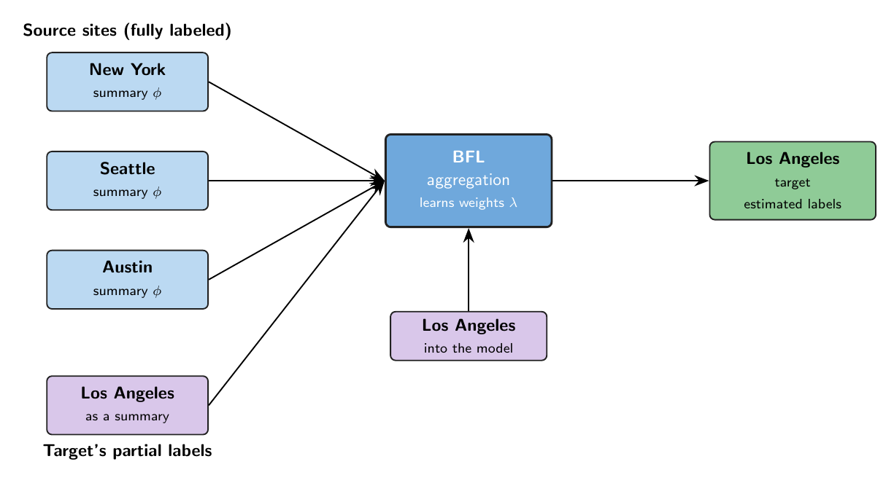

```{r setup, include = FALSE}
knitr::opts_chunk$set(
  collapse = TRUE,
  comment  = "#>",
  fig.width = 7,
  fig.height = 4.5
)
```

## Overview

Suppose you have a **target site** holding both **labeled** and **unlabeled**
records, together with a handful of **source sites** whose records are **fully
labeled**. You would like to borrow strength from the source sites to classify
the target's unlabeled records and to estimate the target's label distribution,
all without any site sharing its raw data.

The **BFL** package implements Bayesian Federated Learning for this setting.
Each source site trains its own local model and shares only a compact **summary**
of that model, so the underlying records never leave the site. BFL then estimates
how well each source model transfers to the target and weights those source
contributions into a single aggregated estimate for the target. Because only
trained summaries cross site boundaries, the method is federated by construction.

## When to use which option

The main thing that determines how you use BFL is **whether the target site has
any labeled records**:

- **No labeled data in the target.** You lean entirely on the source summaries
  to make predictions for the target.
- **Some (partially) labeled data in the target.** The available target labels
  are folded in alongside the source summaries, and the package offers options
  for *how* those labels are used.

You never pass a model-type flag. BFL selects the appropriate path from **what
you give it**, principally whether `Y_target` carries any labels (with `NA` on
the unlabeled records). This vignette walks through both.

## The example

We take the federated premise at face value: **the source summaries are already
given.** In practice each source site trained on its own records and handed you
only the result, so you never see their data. The package ships one such
pre-built bundle, `bfl_cities.rds`, describing four US cities. Each record
carries a categorical label (here a cause-of-death category) and ten yes/no
indicators ("symptoms"):

- **Source sites** (fully labeled, and the ones that provided the summaries):
  **New York**, **Seattle**, **Austin**
- **Target site** (labels hidden below): **Los Angeles**

```{r flow, echo = FALSE, out.width = "100%", fig.cap = "Each source shares only a local summary; BFL learns source weights and aggregates onto the target."}

```

```{r load}
library(BFL)
bfl <- readRDS(system.file("extdata", "bfl_cities.rds", package = "BFL"))
names(bfl$local_summaries)          # the three source summaries
dim(bfl$X_target)                   # the target's own records (N x symptoms)
table(bfl$Y_true)                   # LA truth (used only for scoring)
```

## What a source knows: $P(\text{symptom} \mid \text{cause})$

A source's local model is, in essence, the probability of each symptom given
each cause, learned from its own labeled records. Here is New York's, one row
per cause:

```{r theta}
knitr::kable(round(bfl$theta$NewYork, 2))
```

Read a row as a cause's "symptom fingerprint": COVID-19 leans on fever, cough,
and breathlessness; Heart Attack on chest pain; Stroke on numbness, slurred
speech, and confusion. Each source has its own such table.

## From a source model to a local summary

The object `run_BFL()` actually consumes is not that table, but the model
*applied to the target's records*. For every Los Angeles record, a source scores
the possible causes, giving an $N \times C$ matrix, `posterior_phi`:

```{r phi}
head(round(bfl$local_summaries$NewYork$posterior_phi, 3))
```

A complete **local summary** is just three things:

- `posterior_phi`, the $N \times C$ per-record scores above,
- `cause_ids`, the $C$ label names,
- `target_info$row_hash`, row fingerprints (from `compute_row_hashes()`) that let
  BFL line records up across sites without sharing IDs or raw data.

```{r summary-structure}
str(bfl$local_summaries$NewYork, max.level = 2)
```

Producing this touches only local data, so it is exactly what a site can share.
(The generator that built these summaries lives in `data-raw/make_bfl_cities.R`
for the curious.)

## Option 1: no labeled target data

With no target labels, we lean entirely on the three source summaries. Pass
`Y_target = NULL` and BFL selects the no-label path automatically.

```{r run-nolabels}
fit0 <- run_BFL(
  bfl$local_summaries,
  X_target = bfl$X_target,
  Y_target = NULL,
  sampler  = "gibbs"
)

sc0 <- score_BFL(fit0, Y_eval = bfl$Y_true)
c(top1 = sc0$top1_acc, top1bal = sc0$balanced_acc, csmf = sc0$csmf_acc)
```

Three metrics summarize the fit: **Top-1** accuracy (per-record classification
against the LA truth), **balanced** Top-1 accuracy (the macro-average recall over
causes, which does not reward simply predicting the common causes), and **CSMF**
accuracy (how close the estimated label distribution is to the true one). All
three are achieved without any Los Angeles labels, purely by borrowing the three
sources.

## Option 2: some labeled target data

Now suppose a slice of the Los Angeles records *is* labeled. There are three
natural ways to fold those labels in. We keep a small labeled slice and hide the
rest:

```{r partial-setup}
set.seed(1)
n     <- nrow(bfl$X_target)
keep  <- sample(n, round(0.2 * n))          # keep 20% of LA labeled
Y_obs <- rep(NA_character_, n)
Y_obs[keep] <- bfl$Y_true[keep]             # labels on the kept rows, NA elsewhere
```

<!-- The three run chunks below are written but eval = FALSE; we turn them on and
     verify one at a time, as we did for Option 1. -->

### The labeled rows as an extra summary

The labeled Los Angeles rows train a local model *on the target itself*, which
joins the pool as one more summary. The global model still sees no labels
directly; the target's own signal enters through this extra "self" summary.

```{r fig-extrasource, echo = FALSE, out.width = "100%"}

```

The self-summary requires some local model trained on the target's labeled rows.
Normally these are pre-provided via a pretrained local model. Here, Los Angeles
did not provide one, so we substitute a stand-in using a simple naive-Bayes
model. Below is an optional expandable section to learn more.

<details>
<summary><strong>Building the stand-in self-summary (naive-Bayes)</strong></summary>

In a real deployment the target site would supply its own local self-model
summary (its `local_self`), trained on its partial labels, just as the sources
do. Los Angeles has not shipped one here, so we substitute a lightweight
**naive-Bayes** model built from its labeled rows. It estimates
$P(\text{symptom} \mid \text{cause})$ and turns that into a per-record score over
causes:

$$
\hat\theta_{cj} \;=\; \frac{\sum_{i:\, y_i = c} x_{ij} + \alpha}{n_c + 2\alpha},
\qquad
\phi_{ic} \;\propto\; \prod_{j} \hat\theta_{cj}^{\,x_{ij}}\,\bigl(1-\hat\theta_{cj}\bigr)^{\,1 - x_{ij}},
$$

normalized so that $\sum_c \phi_{ic} = 1$ (a uniform prior over causes). Here
$\hat\theta_{cj}$ is the probability of symptom $j$ given cause $c$, $n_c$ is the
number of labeled rows with cause $c$, and $\alpha$ is a small Laplace-smoothing
constant. The builder:

```{r self-helper}
make_self_summary <- function(X, Y_obs, causes, alpha = 1) {
  theta <- t(vapply(causes, function(cc) {
    sub <- X[!is.na(Y_obs) & Y_obs == cc, , drop = FALSE]
    (colSums(sub) + alpha) / (nrow(sub) + 2 * alpha)      # P(symptom | cause)
  }, numeric(ncol(X))))
  lp  <- X %*% t(log(theta)) + (1 - X) %*% t(log(1 - theta))
  phi <- exp(lp - apply(lp, 1, max)); phi <- phi / rowSums(phi)
  colnames(phi) <- causes
  list(posterior_phi = phi, cause_ids = causes,
       target_info = list(row_hash = compute_row_hashes(X),
                          N = nrow(X), P = ncol(X)))
}
```

</details>

```{r run-extrasource}
la_self        <- make_self_summary(bfl$X_target, Y_obs, bfl$causes)
summaries_plus <- c(bfl$local_summaries, list(LosAngeles = la_self))

fitA <- run_BFL(summaries_plus, X_target = bfl$X_target,
                Y_target = NULL, sampler = "gibbs")
scA  <- score_BFL(fitA, Y_eval = bfl$Y_true)
c(top1 = scA$top1_acc, top1bal = scA$balanced_acc, csmf = scA$csmf_acc)
```

### The labels supplied to the model

Here the observed labels are handed straight to the global model as known
(partial) labels; unlabeled rows stay `NA`. The model uses them directly rather
than through a separate summary.

```{r fig-intomodel, echo = FALSE, out.width = "100%"}

```

```{r run-intomodel}
fitB <- run_BFL(bfl$local_summaries, X_target = bfl$X_target,
                Y_target = Y_obs, label_shift = FALSE,
                sampler = "gibbs")
scB  <- score_BFL(fitB, Y_eval = bfl$Y_true)
c(top1 = scB$top1_acc, top1bal = scB$balanced_acc, csmf = scB$csmf_acc)
```

### A mixture of both

The mixture splits the labeled rows: part become the extra "self" summary, and
part are supplied to the model as partial labels.

```{r fig-mixture, echo = FALSE, out.width = "100%"}

```

```{r run-mixture}
half   <- keep[seq_len(round(length(keep) / 2))]   # these labels -> self summary
other  <- setdiff(keep, half)                       # these labels -> into the model
Y_self <- rep(NA_character_, n); Y_self[half]  <- bfl$Y_true[half]
Y_part <- rep(NA_character_, n); Y_part[other] <- bfl$Y_true[other]

mix_summaries <- c(bfl$local_summaries,
                   list(LosAngeles = make_self_summary(bfl$X_target, Y_self, bfl$causes)))
fitM <- run_BFL(mix_summaries, X_target = bfl$X_target,
                Y_target = Y_part, sampler = "gibbs")
scM  <- score_BFL(fitM, Y_eval = bfl$Y_true)
c(top1 = scM$top1_acc, top1bal = scM$balanced_acc, csmf = scM$csmf_acc)
```

## Inspecting results: `print`, `summary`, `plot`

Both objects BFL produces carry S3 methods, so the usual generics just work. The
fitted model has class `BFL` and the scored result has class `BFL_score`. We
reuse the no-label fit from Option 1 (`fit0`) and its score (`sc0`).

### The fitted model (`BFL`)

Printing gives a one-glance overview:

```{r s3-fit-print}
fit0
```

`summary()` prints the full CSMF table with credible intervals and the learned
source weights:

```{r s3-fit-summary}
summary(fit0)
```

`plot()` draws the CSMF estimates with their credible intervals:

```{r s3-fit-plot, fig.width = 7, fig.height = 4}
plot(fit0)
```

### The scored result (`BFL_score`)

The score object has the same trio. Printing shows the three headline metrics:

```{r s3-score-print}
sc0
```

`summary()` breaks it down per cause (true versus estimated prevalence, and
recall):

```{r s3-score-summary}
summary(sc0)
```

`plot()` shows the per-cause recall and CSMF error:

```{r s3-score-plot, fig.width = 7, fig.height = 4}
plot(sc0)
```

## Session info

```{r session}
sessionInfo()
```
